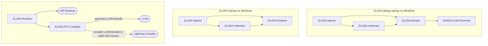
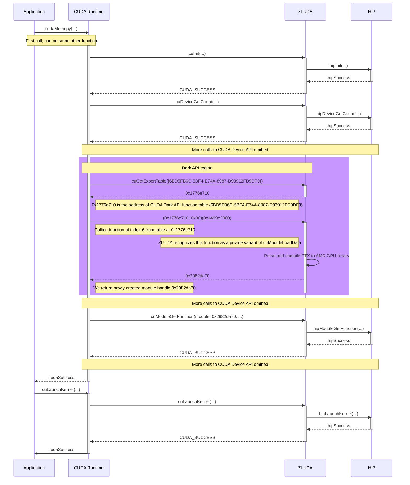

# Architecture of ZLUDA

## Introduction

ZLUDA is a binary-compatible implementation of CUDA for AMD GPUs. An application built with CUDA compiler for NVIDIA GPU can be executed with near-native performance with ZLUDA on AMD GPUs without recompilation or any modifications to the application.  
The principle behind ZLUDA is similar to that of WINE or WSL: to provide a highly-compatible execution environment with a near-native performance.  
The design of the code follows directly from execution requirements of CUDA applications. Accordingly, this document is is split into five parts:  
* Introduction
* CUDA runtime, which describes how CPU code, which controls NVIDIA GPUs is translated to control AMD GPUs
* CUDA GPU code compiler, which describes how NVIDIA GPU code is compiled for AMD GPUs
* Other projects, which describes miscellaneous ZLUDA tools for configuration and debugging
* Diagrams, which show general dependencies between code projects and typical flow of ZLUDA-enabled application

This document will avoid referring to specific files, structures or functions. The project is still in flux and those details are bound to change soon. High-level design, on the other hand will stay the same.

### Top-level design assumptions
If you are reading the code or even the rest of this document, you should be aware of assumptions made when developing the project:  
* ZLUDA itself is written in Rust  
  C or C++ source dependencies are fine if they are are impossible to avoid (LLVM). GPU code in HIP/OpenCL C is fine - Rust support for writing GPU code is pitiful
* ZLUDA is focused on end users  
  By user we mean someone who uses a CUDA program, e.g. a 3D artist using Blender. Developer developing a CUDA application is not an. While we would like to support developers in the future, right now the time constraints do not allow it
* Building the project should require just `cargo build` (if possible)  
  That means that we avoid relying on `cargo` subcommands, `bindgen` or user setting up environment variables certain way to build the project. We can't avoid depending on some tools (cmake, Python), but that's because of C++ dependencies (LLVM)

## CUDA runtime

### Structure of a CUDA application
This is a CUDA "Hello World" application:
```
__global__ void cuda_hello(){
    printf("Hello World from GPU!\n");
}

int main() {
    cuda_hello<<<1,1>>>(); 
    return 0;
}
```
Anyone familiar with C++ will instantly understand that compiling it is a complicated affair. CUDA does add special syntax for GPUs support: address spaces (`__global__` in the example above), kernel calling (`<<...>>` int the example above). Additionally CUDA allows, to a large degree, mixing CPU code and GPU code. What does all this complexity mean for ZLUDA?

Absolutely nothing

Turns out, CUDA compiler transforms CUDA source code into a normal application with calls to CUDA Driver API. The "Hello World" application gets transformed into something not too far from this:
```
char* cuda_hello_ptx = "...";

int main() {
    cuInit();
    CUmodule module = NULL;
    cuModuleLoad(&module, cuda_hello_ptx);
    CUfunction func = NULL;
    cuModuleGetFunction(&func, module, "cuda_hello");
    cuLaunchKernel(func, 1,1,1 1,1,1, NULL, NULL, NULL, NULL);
    return 0;
}
```
All functions starting with `cu` are CUDA Driver API calls to functions in a shared library `nvcuda.dll` or `libcuda.so`. ZLUDA simply provides an alternative `nvcuda.dll` or `libcuda.so` with the same functions, which accept the same arguments. The difference is that an NVIDIA-provided library works with NVIDIA GPUs, a ZLUDA-provided library works with AMD GPUs.

This is a fairly simplified view. In reality, there is more than one CUDA API. Next section explains how to all of them relate to each other and how they are implemented by ZLUDA.

### Three CUDA APIs

More experienced CUDA programmers understand that there are two CUDA APIs. Driver API and Runtime API:

|   | Driver API | Runtime API |
|---|---|---|
| __Function prefix__ | `cu` | `cuda` |
| __Dependencies__ | Kernel-mode driver | Driver API |
| __Dynamic (runtime) linking__ | ✅ | ✅ |
| __Static linking__ | ❌| ✅  |

Driver API is the lowest-level user-mode API. Runtime API builds on top of Driver API and provides miscellaneous high-level features. Since an application can dynamically link to either Driver API or Runtime API, it would seem that ZLUDA needs to provide both. In reality very few applications dynamically link to Runtime API. For the vast majority of applications it's sufficient to provide Driver API for dynamic (runtime) linking.

Driver API implementation is relatively straightforward: for each function ZLUDA calls a similarly called HIP runtime function. HIP is highly compatible with CUDA. For example, `cuDeviceGetAttribute(...)` is implemented by remapping some of the arguments to HIP versions and calling `hipDeviceGetAttribute(...)`. There's one exception: functions for compiling GPU code: `cuModuleLoadData(...)`, `cuModuleLoadDataEx(...)`. It's covered in the section [CUDA GPU code compiler](#cuda-gpu-code-compiler).

In addition to Driver API, Runtime API relies on CUDA Dark API. CUDA Driver API exposes function `cuGetExportTable(...)`. This function accepts a GUID and returns a table of function pointers. Those pointer point to undocumented functions forming CUDA Dark API. It's impossible to tell how many of them exist, but debugging experience suggests there are tens of function pointers across tens of tables. A typical application will use one or two most common. Due to they undocumented nature they are exclusively used by Runtime API and NVIDIA libraries (and in by CUDA applications in turn). We don't have names of those functions nor  names or types of the arguments. This makes implementing them time-consuming. Dark API functions are are reverse-engineered and implemented by ZLUDA on case-by-case basis once we observe an application making use of it.  

In addition, CUDA applications rely on various NVIDIA-provided libraries: NVML, cuBLAS, cuSPARSE. They are implemented by ZLUDA similarly - by providing a library with the same name and with the same functions, which call to native AMD libraries.

## CUDA GPU code compiler

A CUDA application ships with GPU code. This code can be either compiled into PTX or into SASS. The difference is that PTX is a textual assembly not specific to a particular NVIDIA GPU architecture (it is still specific to NVIDIA GPU hardware capabilities) while SASS is a binary asssembly specific to a given a particular NVIDIA GPU architecture. PTX is documented here: [https://docs.nvidia.com/cuda/parallel-thread-execution/index.html](https://docs.nvidia.com/cuda/parallel-thread-execution/index.html). SASS is undocumented.  
Majority of applications ship their GPU code in PTX. PTX is forward compatible with future GPU architectures. For all those reasons, currently, our compiler only supports PTX.
The compiler accepts PTX and outputs AMD GPU binary code. It is structured into a sequence of passes. Output of each pass is the input to the next one. Following sections contain description of the current compilation passes.

Compiler code is end-to-end tested. For every new feature or a bug fix we add a tiny PTX program that makes use of this feature. Firstly it's compiled and the output is compared to the reference LLVM IR. Next it's run and the result is compared to a saved reference result and a result of the same program running on NVIDIA CUDA.


## Other projects

Additionally, ZLUDA ships with more projects which serve some platform-specific purpose or are used for debugging.

### ZLUDA injector (Windows-only)
This is a Windows executable which starts injects process with ZLUDA redirector and a chosen CUDA Runtime API, typically either ZLUDA or ZLUDA dumper. This is a ZLUDA-specific replacement for `LD_PRELOAD`.

### ZLUDA redirector (Windows-only)
This is an injector helper library. It intercepts calls to WinAPI `LoadLibrary...(...)` function calls, detecting attempts to load NVIDIA CUDA library and instead forcing load of the CUDA Runtime API chosen by the injector. Furthermore it intercepts calls to WinAPI `CreateProcess..(...)` function calls to inject itself and the chosen CUDA Runtime API into child processes.

### ZLUDA dumper
This is a CUDA Runtime API implementation for diagnostics and debugging. The library does not have CUDA implementation per-se, but rather for each CUDA Runtime API function call, it intercepts the call, does some kind of pre-processing, routes the call to a real implementation (either ZLUDA or CUDA) and does post-processing. Currently, its main features are:  
* Tracing CUDA application execution. A trace is a log of all CUDA function calls (with parameters and files with all the kernels used by the application
* Single kernel dump (in progress). This allows us to dump to disk a single `cuLaunchKernel(...)` with all the parameters (both memory and scalar). Then this kernel can be debugged without running whole application again
* Side-by-side execution (in progress). This allows to run application normally and for every call to `cuLaunchKernel(...)` also do the same call with another CUDA implementation. The differences in their outputs are then logged


## Diagrams

### Block diagram of the project
External dependencies are in rounded boxes



### Flow of a typical ZLUDA-enabled application
Some details omitted and certain interactions simplified
