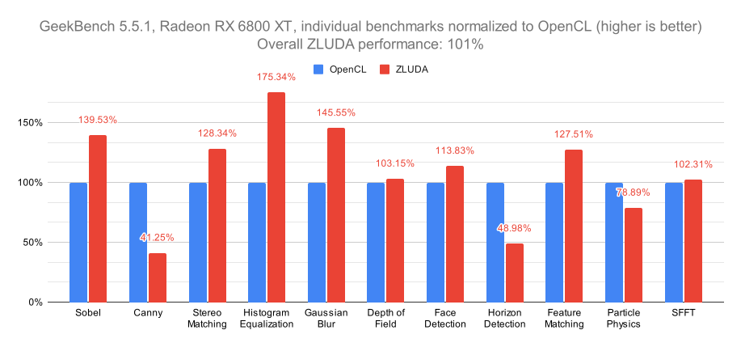

# ZLUDA

ZLUDA lets you run unmodified CUDA applications with near-native performance on ~~Intel~~ AMD GPUs.

ZLUDA is currently alpha quality, but it has been confirmed to work with a variety of native CUDA applications: Geekbench, 3DF Zephyr, Blender, Reality Capture, LAMMPS, NAMD, waifu2x, OpenFOAM, Arnold (proof of concept) and more.

If you want to give it a try, download it from Release page to the right and read [Usage](#usage) and [Known Issues](#known-issues) sections below. If you are interested in its history and future read [FAQ](#faq) section further below.



## Usage

### Windows
Using command line:
```
<ZLUDA_DIRECTORY>\zluda.exe -- <APPLICATION> <APPLICATION_ARGUMENTS>
```
If you downloaded a ZIP file with the release and unpacked it, then `<ZLUDA_DIRECTORY>` is the `zluda` directory you have just unpacked.\
If you are building from source, then `<ZLUDA_DIRECTORY>` is subdirectory `target\release`.

### Linux
Using command line:
```
LD_LIBRARY_PATH="<ZLUDA_DIRECTORY>:$LD_LIBRARY_PATH" <APPLICATION> <APPLICATION_ARGUMENTS>
```
If you downloaded a ZIP file with the release and unpacked it, then `<ZLUDA_DIRECTORY>` is the `zluda` directory you have just unpacked.\
If you are building from source, then `<ZLUDA_DIRECTORY>` is subdirectory `target\release`.

## Build

### Prerequisites

Make sure you have the following installed:
* Git
* CMake
* Python 3
* Rust (1.66.1 or newer)
* C++ compiler
* (Linux only) ROCm 5.7+ (_not ROCm 6_) (https://rocm.docs.amd.com/en/latest/deploy/linux/install_overview.html)
* (Windows only) Recent [AMD Radeon Software Adrenalin](https://www.amd.com/en/technologies/software)
* (Recommended, optional) Ninja (https://ninja-build.org/)

Alternatively, if you are building for Linux, [.devcontainer](.devcontainer) directory contains various developer Dockerfiles with all the required dependencies

### Checkout

Checkout ZLUDA code with:
```
git clone --recurse-submodules https://github.com/vosen/zluda.git
```

### Build
Build by running:

```
cargo xtask --release
```

## Unknown issues

If an application fails to start under ZLUDA or crashes please check [Known Issues](#known-issues) section below. If nothing there applies, then please read [TROUBLESHOOTING.md](TROUBLESHOOTING.md).

## Known Issues

### Hardware

- If both integrated AMD GPU and dedicated AMD GPU are present in the system, ZLUDA uses the integrated GPU.

  This is a bug in underlying ROCm/HIP runtime. You can work around it by disabling the integrated GPU.

  On Windows we recommend you use environment variable `HIP_VISIBLE_DEVICES=1` environment variable (more [here](https://rocmdocs.amd.com/en/latest/conceptual/gpu-isolation.html#hip-visible-devices)) or disable it system-wide in Device Manager.

  On Linux we recommend you use environment variable `ROCR_VISIBLE_DEVICES=<UUID>` where `<UUID>` is the UUID of the dedicated GPU as reported by `rocminfo` command line tool (you can also use `HIP_VISIBLE_DEVICES=1`, but this does not seem to be stable). Alternatively you can disable integrated GPU system-wide by passing `pci-stub.ids=<DEVICE_VENDOR>:<DEVICE_CODE>` to the kernel options. On Ubuntu you can pass additional kernel options by adding them to `/etc/default/grub` to the option `GRUB_CMDLINE_LINUX_DEFAULT`. You can find `<DEVICE_VENDOR>:<DEVICE_CODE>` with the help of `lspci -nn`. This will emit a series of lines with one of them matching you integrated GPU, for example:\
  `1b:00.0 VGA compatible controller [0300]: Advanced Micro Devices, Inc. [AMD/ATI] Device [1002:164e] (rev c1)`\
  `<DEVICE_VENDOR>:<DEVICE_CODE>` ar at the end, in this case `1002:164e`.

- Integrated GPUs (as tested with Radeon 680M) work in a limited way. Some rarely used GPU operations (abort, printf, etc.) will hang or crash the application. Additionally, performance library support (cuBLAS, cuDNN, etc.) might be limited, rendering more complex applications inoperable.

- ZLUDA can use AMD server GPUs (as tested with Instinct MI200) with a caveat.

  On Server GPUs, ZLUDA can compile CUDA GPU code to run in one of two modes:
  - Fast mode, which is faster, but can make exotic (but correct) GPU code hang.
  - Slow mode, which should make GPU code more stable, but can prevent some applications from running on ZLUDA.

  By default, ZLUDA uses fast mode. That's because:
  - There's a huge performance difference, fast mode can be twice as fast.
  - The code patterns that can trip fast mode were not encountered across multiple projects (SPECFEM3D, QUDA, CHroma, MILC, Kokkos, LAMMPS, OpenFOAM, XGBoost, NAMD, LAMMPS).

  You can use environment variable `ZLUDA_WAVE64_SLOW_MODE=1` to force compilation in slow mode.

  Nothing of that applies to desktop and integrated GPUs (RDNA family).


### Software

- Applications using ZLUDA are slow to start.

  On the first start ZLUDA needs to compile GPU code for the application. This is a one-time cost, compiled GPU code is cached in `%LOCALAPPDATA%` on Windows and in `$XDG_CACHE_HOME` or `$HOME/.cache` on Linux.\
  Some applications will gradually load the GPU code as it is used. If that is undesirable you can try setting environment variable `CUDA_MODULE_LOADING=EAGER`. It depends on how the application was programmed, but it might force to load (and compile) all the kernels on startup, no matter if they are used or not.

- Applications running ZLUDA might produce slightly different values

  Firstly, ZLUDA ignores some of the floating point denormal and rounding mode information present in the kernels. Secondly, for certain approximate (not IEEE 754) NVIDIA floating point operations in CUDA, ZLUDA blindly uses approximate AMD floating point operations. The two might have a different precision.

#### CUDA 12+
- Application built with CUDA 12 and using Thrust crashes with `LLVM ERROR: unsupported libcall legalization`. 
  
  This is a ROCm/HIP bug. Currently, CUDA applications built with CUDA versions pre-12 work the best. Building with CUDA 12 and a pre-CUDA 12 Thrust might also work.

#### OptiX
- ZLUDA has a bare-minimum OptiX implementation for Arnold. See details in [Arnold](#arnold) section.

#### Windows
- Antivirus flags ZLUDA as malware.

  ZLUDA launcher (`zluda.exe`) uses some of the techniques used by malware, but for good. `zluda.exe` hijacks the process and redirects all uses of the original NVIDIA's CUDA libraries to use ZLUDA's CUDA instead.

  <u>Don't use `zluda.exe` with games that use anti-cheat.</u> ZLUDA does not support CUDA gaming workloads (PhysX or DLSS) and anti-cheat might mistake `zluda.exe` for a malware or a cheat.

- Following error when launching an application with `zluda.exe`: `Error: OsError { function: "DetourCreateProcessWithDllsW", error_code: 740, message: "The requested operation requires elevation." }`

  You are launching an application that requires Administrator rights through `zluda.exe`. Try launching `zluda.exe` from an Administrator command line.

- ZLUDA offers limited support for performance libraries (cuDNN, cuBLAS, cuSPARSE, cuFFT, OptiX, NCCL). Currently, this support is Linux-only and not available on Windows.

- ZLUDA launcher (`zluda.exe`) does not support 32 bit processes. If an application launches 32 bit subprocess `a.exe` neither the 32 bit process `a.exe`, nor its 64 bit subprocess `a64.exe` will be able to use ZLUDA. This affects e.g. SiSoft Sandra.

### Applications

#### llama.cpp

If you are building llama.cpp with cmake and don't want it to crash on ZLUDA then you should use `CUDA_DOCKER_ARCH=compute_61` like this:
```
make CUDA_DOCKER_ARCH=compute_61 
```
Alternatively, building with cmake should work with no changes.

Performance is currently much lower than the native HIP backend, see the discussion in #102.

#### Arnold

* ZLUDA implements minimum of OptiX framework to support Arnold. ZLUDA's OptiX is buggy, unoptimized and incomplete. It's been tested with Arnold 7.1.4.1 command line rendering on Linux.

  ZLUDA-OptiX is not built by default or redistributed in the release. To use it follow those steps:
 
  * Firstly build a newer version of ROCm LLVM. Version shipped with 5.7.1 is known to miscompile Arnold code. Get it here: https://github.com/ROCm/llvm-project. Switch to a known good commit: `0c7fd5b6d1bbf471d2c068c2b6172d9cfd76b08d` and build it.

  * Then build amd_comgr: https://github.com/ROCm/ROCm-CompilerSupport with the LLVM built in the previous step. I'm using the last commit from https://github.com/ROCm/ROCm-CompilerSupport (`8276083301409001ec7643e68f5ad58b057c21fd`).

  * Now build ZLUDA-OptiX:
    ```
    cargo ctask --release
    cargo build -p zluda_rt --release
    cd target/release
    ln -s libnvoptix.so liboptix.so.6.6.0 
    cp ../../hiprt-sys/lib/libhiprt64.so .
    ```

  * After those quick and easy steps you can use it with the command line Arnold renderer:
    ```
    LD_LIBRARY_PATH=<PATH_TO_ZLUDA>/target/release/ LD_PRELOAD="<PATH_TO_COMGR>/build/libamd_comgr.so.2 <PATH_TO_ZLUDA>/liboptix.so.6.6.0" /usr/autodesk/arnold/maya2023/bin/kick attic.ass  -device gpu -o /tmp/attic.jpg -v 6 -sl
    ```

  * Keep in mind that ZLUDA-OptiX can only successfully render the simplest Arnold scene (and possibly one more):
     
     * Cornell box (from [here](https://help.autodesk.com/view/ARNOL/ENU/?guid=arnold_user_guide_ac_scene_source_ac_ass_examples_html)):\
     [](https://imgur.com/4Vv3GO8)
     * (used to work, broken now) Attic scene (from [here](https://github.com/wahn/export_multi/tree/master/17_attic)):\
     [](https://imgur.com/a/2jF9Kb5)

#### PyTorch

* PyTorch received very little testing. ZLUDA's coverage of cuDNN APIs is very minimal (just enough to run ResNet-50) and realistically you won't get much running.\
  However if you are interested in trying it out you need to build it from sources with the settings below. Default PyTorch does not ship PTX and uses bundled NCCL which also builds without PTX:

  ```
  export TORCH_CUDA_ARCH_LIST="6.1+PTX"
  export CUDAARCHS=61
  export CMAKE_CUDA_ARCHITECTURES=61
  export USE_SYSTEM_NCCL=1
  export NCCL_ROOT_DIR=/usr
  export NCCL_INCLUDE_DIR=/usr/include
  export NCCL_LIB_DIR=/usr/lib/x86_64-linux-gnu
  export USE_EXPERIMENTAL_CUDNN_V8_API=OFF
  ```
  or (untested):
  ```
  export TORCH_CUDA_ARCH_LIST="6.1+PTX"
  export CUDAARCHS=61
  export CMAKE_CUDA_ARCHITECTURES=61
  export USE_SYSTEM_NCCL=1
  export USE_NCCL=0
  export USE_EXPERIMENTAL_CUDNN_V8_API=OFF
  ```

  When running use the following environment variable:
  ```
  DISABLE_ADDMM_CUDA_LT=1
  ```


#### 3DF Zephyr
- ZLUDA is much slower than CUDA.

  3DF Zephyr is triggering an underlying ROCm/HIP performance issue.

#### Reality Capture
- ZLUDA is much slower than CUDA.

  Reality Capture is triggering an underlying ROCm/HIP performance issue.

#### CompuBench

- When running multiple tests, first test passes and the subsequent tests fail with `CUDA_ERROR_UNKNOWN`.
  
  This is a ROCm/HIP bug. Currently, CompuBench tests have to be run one at a time.

#### V-Ray Benchmark

- Currently, ZLUDA crashes when running V-Ray benchmark. Nonetheless, certain "lucky" older combinations of ZLUDA and ROCm/HIP are known to run V-Ray Benchmark successfully.

#### Cinebench CUDA

- ZLUDA can't run it. Cinebench CUDA benchmark has not been fully compiled with PTX. It may be possible to run it (sans OptiX) if the OctaneBench developers re-compile it.

#### OctaneBench

- ZLUDA can't run it. OctaneBench has not been fully compiled with PTX. It may be possible to run it (sans OptiX) if the OctaneBench developers re-compile it.

## FAQ

- Why is this project suddenly back after 3 years? What happened to Intel GPU support?

  In 2021 I was contacted by Intel about the development of ZLUDA. I was an Intel employee at the time. While we were building a case for ZLUDA internally, I was asked for a far-reaching discretion: not to advertise the fact that Intel was evaluating ZLUDA and definitely not to make any commits to the public ZLUDA repo. After some deliberation, Intel decided that there is no business case for running CUDA applications on Intel GPUs.

  Shortly thereafter I got in contact with AMD and in early 2022 I have left Intel and signed a ZLUDA development contract with AMD. Once again I was asked for a far-reaching discretion: not to advertise the fact that AMD is evaluating ZLUDA and definitely not to make any commits to the public ZLUDA repo. After two years of development and some deliberation, AMD decided that there is no business case for running CUDA applications on AMD GPUs.

  One of the terms of my contract with AMD was that if AMD did not find it fit for further development, I could release it. Which brings us to today.


* What's the future of the project?

  With neither Intel nor AMD interested, we've run out of GPU companies. I'm open though to any offers of that could move the project forward.

  Realistically, it's now abandoned and will only possibly receive updates to run workloads I am personally interested in (DLSS).

* What underlying GPU API does ZLUDA use? Is it OpenCL? ROCm? Vulkan?

  ZLUDA is built purely on ROCm/HIP. On both Windows and Linux.

* I am a developer writing CUDA code, does this project help me port my code to ROCm/HIP?

  Currently no, this project is strictly for end users. However this project could be used for a much more gradual porting from CUDA to HIP than anything else. You could start with an unmodified application running on ZLUDA, then have ZLUDA expose the underlying HIP objects (streams, modules, etc.), allowing to rewrite GPU kernels one at a time. Or you could have a mixed CUDA-HIP application where only the most performance sensitive GPU kernels are written in the native AMD language.

## For developers

If you are curious about ZLUDA's architecture, you can read a broad overview in [ARCHITECTURE.md](ARCHITECTURE.md). If you want to debug ZLUDA check the "Debugging" section in [TROUBLESHOOTING.md](TROUBLESHOOTING.md#debugging).

## License

This software is dual-licensed under either the Apache 2.0 license or the MIT license. See [LICENSE-APACHE](LICENSE-APACHE) or [LICENSE-MIT](LICENSE-MIT) for details
