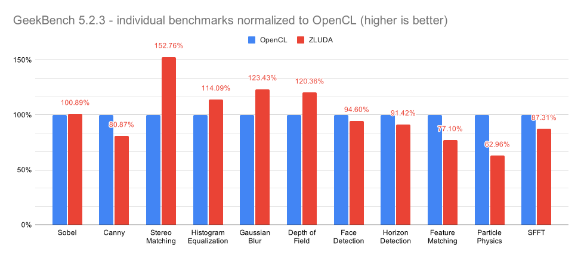

# ZLUDA

ZLUDA is a drop-in replacement for CUDA on Intel GPU. ZLUDA allows to run unmodified CUDA applications using Intel GPUs with near-native performance (more below). It works with current integrated Intel UHD GPUs and will work with future Intel Xe GPUs

## Performance

ZLUDA performance has been measured with GeekBench 5.2.3 on Intel UHD 630.\
One measurement has been done using OpenCL and another measurement has been done using CUDA with Intel GPU masquerading as a (relatively slow) NVIDIA GPU with the help of ZLUDA. Both measurements use the same GPU.

Performance below is normalized to OpenCL performance. 110% means that ZLUDA-implemented CUDA is 10% faster on Intel UHD 630.



[ZLUDA detailed log on Geekbench.com](https://browser.geekbench.com/v5/compute/1918048)

[OpenCL detailed log on Geekbench.com](https://browser.geekbench.com/v5/compute/1918080)

Overall in this suite of benchmarks faster by approximately 4% on ZLUDA.

### Explanation of the results
 * Why is ZLUDA faster in Stereo Matching, Gaussian Blur and Depth of Field?\
   This has not been precisely pinpointed to one thing or another but it's likely a combination of things:
   * ZLUDA uses Level 0, which in general is a more level, higher performance API
   * Tying to the previous point, currently ZLUDA does not support asynchronous execution. This gives us an unfair advantage in a benchmark like GeekBench. GeekBench exclusively uses CUDA synchronous APIs
   * There is a set of GPU instructions which are available on both NVIDIA hardware and Intel hardware, but are not exposed through OpenCL. We are comparing NVIDIA GPU optimized code with the more general OpenCL code. It's a lucky coincidence (and a credit to the underlying Intel Graphics Compiler) that this code also works well on an Intel GPU
 * Why is OpenCL faster in Canny and Horizon Detection?\
   Authors of CUDA benchmarks used CUDA functions `atomicInc` and `atomicDec` which have direct hardware support on NVIDIA cards, but no hardware support on Intel cards. They have to be emulated in software, which limits performance
 * Why are some benchmarks failing?\
   ZLUDA itself supports all the operations used in the failing benchmarks. From the limited debugging that has been done so far, the problem is most likely somewhere else. Intel GPU compiler stack is very capable when it comes to compiling OpenCL, C for Metal and DPC++. It's not yet very good at compiling ZLUDA. ZLUDA emits code patterns never seen before by the Intel GPU compiler stack and hits some rarely used (or not used before) code paths in the compiler.\
   Current status of failing GeekBench tests is tracked [here](https://github.com/vosen/ZLUDA/pull/12)
   

## Details

 * Is ZLUDA a drop-in replacement for CUDA?\
   Yes, but certain applications use CUDA in ways which make it incompatible with  ZLUDA.
 * What is the status of the project\
   This project is a Proof of Concept. About the only thing that works currently is  Geekbench (and not even completely). It's amazingly buggy and incomplete. You  should not rely on it for anything serious
 * Is it an Intel project? Is it an NVIDIA project?\
   No, it's a private project
 * What is the performance?\
   Performance can be clode to the performance of similarly written OpenCL code (see  GeekBench results in the previous section).  NVIDIA GPUs and Intel GPUs have  different architecture and feature set. Consequently, certain NVIDIA features have  to be emulated in ZLUDA with performance penalty. Additionally, performance of  ZLUDA will be always lower than the performance of code specifically optimized for  Intel GPUs
 * How it's different from AMD HIP or Intel DPC++ Compatibility toolkit?\
   Both are porting toolkits which require programmer's effort to port applications  to the API in question. With ZLUDA existing applications "just work" on an Intel  GPU (if you are lucky and ZLUDA supports the particular subset of CUDA)
 * Which Intel GPU are supported?\
   Intel Gen9 and newer (Skylake and newer) which are supported by Intel Level 0
 * Does ZLUDA support AMD GPUs?\
   Certainly not currently, but it might be technically possible


## Usage
**Warning**: this is a very incomplete Proof of Concept. It's probably not going to work with your application. ZLUDA currently works only with applications which use CUDA Driver API. Linux builds also work with applications which use statically-linked CUDA Runtime API

### Windows
You should have the most recent GPU drivers installed.\
Copy `nvcuda.dll` to the application directory (the directory where .exe file is) and launch it normally

### Linux
A very recent version of [compute-runtime](https://github.com/intel/compute-runtime) is required. At the time of the writing 20.45.18403 is the recommended version.
Unpack the archive somewhere and run your application like this:
```
LD_LIBRARY_PATH=<PATH_TO_THE_DIRECTORY_WITH_ZLUDA_PROVIDED_LIBCUDA> <YOUR_APPLICATION>
```

## Building
You should have a relatively recent version of Rust installed, then you just do:

```
cargo build
```
in the main directory of the project
### Known build issues and workarounds:
+ * cmake not installed on Windows: * Install windows binaries from https://cmake.org/download/
+ * CMake Error: The source directory ".../ZLUDA/ext/spirv-tools" does not appear to contain CMakeLists.txt.*: update linked git submodules 
```
git submodule init
git submodule update
```

## License

This software is dual-licensed under either the Apache 2.0 license or the MIT license. See [LICENSE-APACHE](LICENSE-APACHE) or [LICENSE-MIT](LICENSE-MIT) for details
