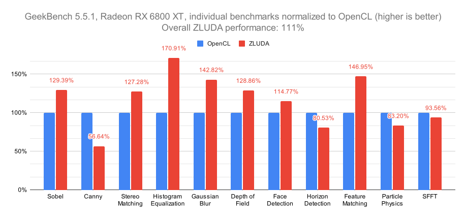

[](https://discord.gg/sg6BNzXuc7)

# ZLUDA

ZLUDA is a drop-in replacement for CUDA on non-NVIDIA GPU. ZLUDA allows to run unmodified CUDA applications using non-NVIDIA GPUs with near-native performance.

ZLUDA supports AMD Radeon RX 5000 series and newer GPUs (both desktop and integrated).



ZLUDA is work in progress. Follow development here and say hi on [Discord](https://discord.gg/sg6BNzXuc7). For more details see the announcement: https://vosen.github.io/ZLUDA/blog/zludas-third-life/

## Usage
**Warning**: This version ZLUDA is under heavy development (more [here](https://vosen.github.io/ZLUDA/blog/zludas-third-life/)) and right now only supports Geekbench. ZLUDA probably will not work with your application just yet.

### Windows
You should have recent AMD GPU driver ("AMD Software: Adrenalin Edition") installed.\
To run your application you should etiher:
* (Recommended approach) Copy ZLUDA-provided `nvcuda.dll` and `nvml.dll` from `target\release` (if built from sources) or `zluda` (if downloaded a zip package) into a path which your application uses to load CUDA. Paths vary application to application, but usually it's the directory where the .exe file is located
* Use ZLUDA launcher like below. ZLUDA launcher is known to be buggy and incomplete:
    ```
    <ZLUDA_DIRECTORY>\zluda_with.exe -- <APPLICATION> <APPLICATIONS_ARGUMENTS>
    ```

### Linux

Run your application like this:
```
LD_LIBRARY_PATH=<ZLUDA_DIRECTORY> <APPLICATION> <APPLICATIONS_ARGUMENTS>
```

where `<ZLUDA_DIRECTORY>` is the directory which contains ZLUDA-provided `libcuda.so`: `target/release` if you built from sources or `zluda` if you downloaded prebuilt package.

### MacOS

Not supported

## Building

### Dependencies

* Git
* CMake
* Python 3
* Rust compiler (recent version)
* C++ compiler
* (Optional, but recommended) [Ninja build system](https://ninja-build.org/)

### Build steps

* Git clone the repo (make sure to use `--recursive` option to fetch submodules):  
`git clone --recursive https://github.com/vosen/ZLUDA.git`  
* Enter freshly cloned `ZLUDA` directory and build with cargo (this takes a while):  
`cargo build --release`

### Linux

If you are building on Linux you must also symlink the ZLUDA output binaries after ZLUDA build finishes:
```
cd target/release
ln -s libnvcuda.so libcuda.so
ln -s libnvcuda.so libcuda.so.1
ln -s libnvml.so libnvidia-ml.so
ln -s libnvml.so libnvidia-ml.so.1
```

## Contributing

ZLUDA project has a commercial backing and _does not_ accept donations.
ZLUDA project accepts pull requests and other non-monetary contributions.

If you want to contribute a code fix or documentation update feel free to open a Pull Request.

### Getting started

There's no architecture document (yet). Two most important crates in ZLUDA are `ptx` (PTX compiler) and `zluda` (AMD GPU runtime). A good starting point to tinkering the project is to run one of the `ptx` unit tests under a debugger and understand what it is doing. `cargo test -p ptx -- ::add_hip` is a simple test that adds two numbers.

Github issues tagged with ["help wanted"](https://github.com/vosen/ZLUDA/issues?q=is%3Aissue+is%3Aopen+label%3A%22help+wanted%22) are tasks that are self-containted. Their level of difficulty varies, they are not always good beginner tasks, but they defined unambiguously.

If you have questions feel free to ask on [#devtalk channel on Discord](https://discord.com/channels/1273316903783497778/1303329281409159270).


## License

This software is dual-licensed under either the Apache 2.0 license or the MIT license. See [LICENSE-APACHE](LICENSE-APACHE) or [LICENSE-MIT](LICENSE-MIT) for details
