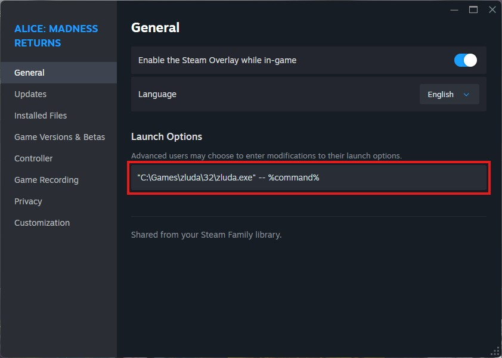
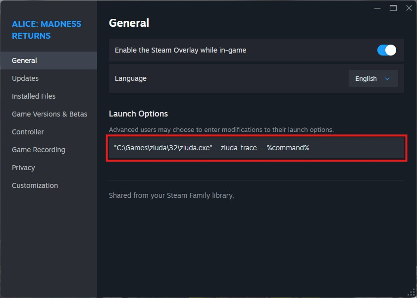

# PhysX (32 bit)

ZLUDA has a limited implementation of 32-bit CUDA tailored for PhysX.
There are three ways to use it:

* <i class="fa-brands fa-steam"></i> Steam game

  Open the game's "Properties" and enter the following in "Launch Options":

  `"<PATH_TO_ZLUDA>\32\zluda.exe" -- %command%`

  

* Using launcher directly

  Open a command prompt and launch the game with 32-bit `zluda.exe`:

  `<PATH_TO_ZLUDA>\32\zluda.exe -- <PATH_TO_GAME_EXE>`

* System install

  <i class="fa-solid fa-triangle-exclamation"></i>
  This is not a recommended way to load ZLUDA. Use it only if nothing else works.
  <i class="fa-solid fa-triangle-exclamation"></i>

  * Copy `nvapi.dll` and `nvcuda.dll` from the `32` directory to `C:\Windows\SysWOW64` (requires Administrator permissions)
  * Set the `ZLUDA64_PATH` environment variable to the ZLUDA directory (it must contain `zluda64_server.exe`)

## Known Issues

* Reinitializing PhysX might fail. Changing in-game PhysX settings can crash or hang the game.

## Troubleshooting

If your game does not work, try collecting a trace.

* When using a launcher (through Steam or directly)

  Add the `--zluda-trace` option to `zluda.exe`.
  If you have access to an NVIDIA GPU, you can also collect a trace on NVIDIA with `--nvidia-trace`.

  

* When using a system install

  <i class="fa-solid fa-triangle-exclamation"></i>
  This is not a recommended way to load ZLUDA. Use it only if nothing else works.
  <i class="fa-solid fa-triangle-exclamation"></i>

  * Copy `nvapi.dll` and `nvcuda.dll` from `32\trace` to `C:\Windows\SysWOW64`
  * Set environment variable `ZLUDA_NVAPI_LIB` to the full path to `32\nvapi.dll`
  * Set environment variable `ZLUDA_CUDA_LIB` to the full path to `32\nvcuda.dll`

Read more about traces [here](troubleshooting.md).

## Supported games

ZLUDA was tested with:
* Mirror's Edge
* Alice: Madness Returns
* Mafia II (Classic)

Most games should work. If your game does not work, see the [Troubleshooting](#troubleshooting) section above.