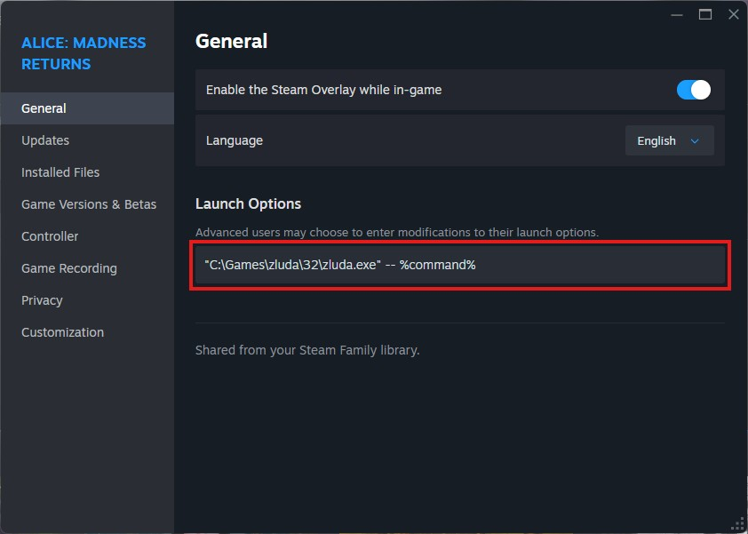
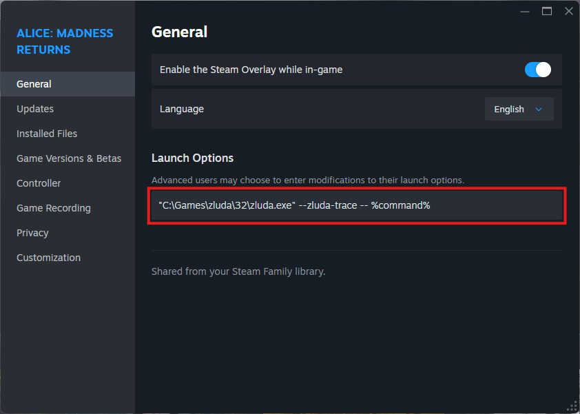

# PhysX (32 bit)

## Prerequisites

Install the latest [NVIDIA PhysX System Software](https://www.nvidia.com/en-us/drivers/physx/physx-9-19-0218-driver/). Most PhysX-enabled games ship with their own outdated versions of PhysX, which are not recommended for use with ZLUDA.

## Setup

ZLUDA provides a limited implementation of 32-bit CUDA tailored for PhysX.
There are three ways to use it:

* <i class="fa-brands fa-steam"></i> Steam game

  Open the game's "Properties" and enter the following in "Launch Options":

  `"<PATH_TO_ZLUDA>\32\zluda.exe" -- %command%`

  

* Using the launcher directly

  Open a command prompt and launch the game with the 32-bit `zluda.exe`:

  `<PATH_TO_ZLUDA>\32\zluda.exe -- <PATH_TO_GAME_EXE>`

* System-wide install

  <i class="fa-solid fa-triangle-exclamation"></i>
  This is not a recommended way to load ZLUDA. Use it only if nothing else works.
  <i class="fa-solid fa-triangle-exclamation"></i>

  * Copy `nvapi.dll` and `nvcuda.dll` from the `32` directory to `C:\Windows\SysWOW64` (requires Administrator permissions)
  * Set the `ZLUDA64_PATH` environment variable to the ZLUDA directory (it must contain `zluda64_server.exe`)

## Known Issues

* Reinitializing PhysX might fail. Changing in-game PhysX settings can crash or hang the game.

## Troubleshooting

Start by running ZLUDA with a simple PhysX application. Two good choices are:

* [Fluidmark](https://www.geeks3d.com/20130308/fluidmark-1-5-1-physx-benchmark-fluid-sph-simulation-opengl-download/)
* Samples from the [PhysX SDK](https://developer.download.nvidia.com/PhysX/2.8.1/PhysX_2.8.1_SDK_Core.msi) (once installed, available in the `Bin\win32` directory of the SDK)

If your game does not work, try collecting a trace.

* When using the launcher (through Steam or directly)

  Add the `--zluda-trace` option to `zluda.exe`.
  If you have access to an NVIDIA GPU, you can also collect a trace on NVIDIA with `--nvidia-trace`.

  

* When using a system-wide install

  <i class="fa-solid fa-triangle-exclamation"></i>
  This is not a recommended way to load ZLUDA. Use it only if nothing else works.
  <i class="fa-solid fa-triangle-exclamation"></i>

  * Copy `nvapi.dll` and `nvcuda.dll` from `32\trace` to `C:\Windows\SysWOW64`
  * Set the `ZLUDA_NVAPI_LIB` environment variable to the full path of `32\nvapi.dll`
  * Set the `ZLUDA_CUDA_LIB` environment variable to the full path of `32\nvcuda.dll`

Read more about traces [here](troubleshooting.md).

## Supported games

ZLUDA has been tested with:
* Mirror's Edge
* Alice: Madness Returns
* Mafia II (Classic)

Games with known issues:
* Batman: Arkham Origins with PhysX set to High can lead to geometry explosions

Most games should work. If your game does not work, see the [Troubleshooting](#troubleshooting) section above. If that does not help, contact us on Discord or GitHub.